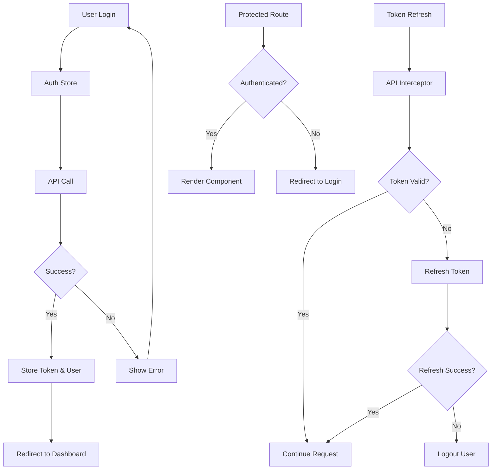

# Work Finder - Architecture Documentation

## 🏗️ Architecture Overview

This document provides a comprehensive overview of the Work Finder application architecture, built with modern React patterns and best practices.

## 📋 Technology Stack

### Core Technologies
- **React 19** - Latest React with concurrent features
- **TypeScript** - Type-safe development
- **Vite** - Fast build tool and development server

### State Management
- **Zustand** - Lightweight state management for client state
- **TanStack Query** - Server state management with caching
- **Persist Middleware** - State persistence for authentication

### UI Framework
- **Ant Design** - Enterprise-class UI components
- **Custom CSS** - Global styles and utility classes
- **Responsive Design** - Mobile-first approach

### Routing & Navigation
- **React Router v6** - Declarative routing
- **Lazy Loading** - Code splitting for better performance
- **Protected Routes** - Authentication-based route protection

## 🏛️ Project Structure

```
src/
├── components/           # Reusable UI components
│   ├── ui/              # Basic UI components
│   │   ├── loading.tsx      # Loading states and skeletons
│   │   ├── error-boundary.tsx # Error handling
│   │   ├── page-header.tsx   # Page header component
│   │   └── empty-state.tsx   # Empty state component
│   ├── forms/           # Form components
│   │   ├── login-form.tsx    # Authentication forms
│   │   └── register-form.tsx
│   └── layout/          # Layout components
│       ├── app-layout.tsx    # Main application layout
│       ├── app-header.tsx    # Application header
│       ├── app-sidebar.tsx   # Navigation sidebar
│       └── notification-container.tsx # Global notifications
├── pages/               # Page components
│   ├── dashboard.tsx        # Dashboard with statistics
│   ├── jobs.tsx            # Job listings with filters
│   ├── job-detail.tsx      # Individual job details
│   ├── create-job.tsx      # Job creation form
│   ├── profile.tsx         # User profile management
│   ├── settings.tsx        # Application settings
│   ├── login.tsx           # Login page
│   └── register.tsx        # Registration page
├── hooks/               # Custom React hooks
│   ├── use-api.ts          # TanStack Query hooks
│   ├── use-debounce.ts     # Debounce utility hook
│   ├── use-local-storage.ts # Local storage hook
│   ├── use-click-outside.ts # Click outside detection
│   ├── use-pagination.ts   # Pagination logic
│   └── index.ts            # Hook exports
├── stores/              # Zustand stores
│   ├── auth-store.ts       # Authentication state
│   └── app-store.ts        # Global application state
├── services/            # API services
│   └── api.ts              # Axios configuration and endpoints
├── types/               # TypeScript definitions
│   └── index.ts            # Global types and interfaces
├── utils/               # Utility functions
│   └── index.ts            # Helper functions and formatters
├── constants/           # Application constants
│   └── index.ts            # Configuration and constants
├── styles/              # Global styles
│   └── global.css          # CSS utilities and global styles
└── lib/                 # Third-party configurations
    └── antd-config.ts      # Ant Design theme configuration
```

## 🔄 State Management Architecture

### Client State (Zustand)
- **Authentication Store** (`auth-store.ts`)
  - User authentication state
  - JWT token management
  - Login/logout actions
  - Persistent storage

- **Application Store** (`app-store.ts`)
  - UI state (sidebar, theme, loading)
  - Global notifications
  - Modal state management
  - Search state

### Server State (TanStack Query)
- **API Hooks** (`use-api.ts`)
  - Data fetching with caching
  - Mutation handling
  - Error management
  - Loading states

## 🛡️ Authentication Flow



## 🎨 UI Component Architecture

### Component Hierarchy
```
App
├── ErrorBoundary
├── QueryClientProvider
├── BrowserRouter
├── ConfigProvider (Ant Design)
└── Routes
    ├── PublicRoute (Login, Register)
    └── ProtectedRoute
        └── AppLayout
            ├── AppHeader
            ├── AppSidebar
            └── Content (Page Components)
```

### Design System
- **Consistent Spacing** - 8px grid system
- **Typography Scale** - Ant Design typography
- **Color Palette** - Primary blue (#1890ff) with semantic colors
- **Component Variants** - Size variants (small, default, large)
- **Responsive Breakpoints** - Mobile-first design

## 🔌 API Integration

### HTTP Client Configuration
```typescript
// Axios instance with interceptors
const api = axios.create({
  baseURL: process.env.VITE_API_URL,
  timeout: 10000,
});

// Request interceptor - Add auth token
api.interceptors.request.use((config) => {
  const token = useAuthStore.getState().token;
  if (token) {
    config.headers.Authorization = `Bearer ${token}`;
  }
  return config;
});

// Response interceptor - Handle errors
api.interceptors.response.use(
  (response) => response,
  async (error) => {
    if (error.response?.status === 401) {
      // Handle token refresh or logout
    }
    return Promise.reject(error);
  }
);
```

### Query Management
- **Caching Strategy** - 5-minute stale time for most queries
- **Error Handling** - Global error notifications
- **Loading States** - Component-level loading indicators
- **Optimistic Updates** - Immediate UI updates for mutations

## 🚀 Performance Optimizations

### Code Splitting
- **Lazy Loading** - All page components are lazy-loaded
- **Route-based Splitting** - Automatic code splitting by routes
- **Component Splitting** - Heavy components split when needed

### Caching Strategy
- **Query Caching** - TanStack Query handles server state caching
- **Local Storage** - Authentication state persistence
- **Memory Optimization** - Proper cleanup of subscriptions

### Bundle Optimization
- **Tree Shaking** - Unused code elimination
- **Asset Optimization** - Image and font optimization
- **Chunk Splitting** - Vendor and app code separation

## 🔒 Security Considerations

### Authentication Security
- **JWT Tokens** - Secure token-based authentication
- **Token Refresh** - Automatic token renewal
- **Secure Storage** - Tokens stored in memory when possible
- **Route Protection** - Authentication guards on protected routes

### Data Security
- **Input Validation** - Form validation on client and server
- **XSS Prevention** - Proper data sanitization
- **CSRF Protection** - Token-based request validation
- **HTTPS Only** - Secure communication in production

## 📱 Responsive Design

### Breakpoint Strategy
```css
/* Mobile First Approach */
@media (max-width: 768px) {
  .mobile-hidden { display: none !important; }
  .mobile-full-width { width: 100% !important; }
}

@media (min-width: 769px) {
  .desktop-hidden { display: none !important; }
}
```

### Component Responsiveness
- **Grid System** - Ant Design's responsive grid
- **Flexible Layouts** - CSS Flexbox and Grid
- **Adaptive Components** - Components that adapt to screen size
- **Touch-friendly** - Mobile-optimized interactions

## 🧪 Testing Strategy

### Testing Pyramid
- **Unit Tests** - Individual component testing
- **Integration Tests** - Component interaction testing
- **E2E Tests** - Full user flow testing

### Testing Tools (Recommended)
- **Jest** - Unit testing framework
- **React Testing Library** - Component testing
- **MSW** - API mocking for tests
- **Cypress** - End-to-end testing

## 🚀 Deployment Architecture

### Build Process
```bash
# Development
npm run dev          # Start development server

# Production
npm run build        # Build for production
npm run preview      # Preview production build
```

### Environment Configuration
- **Development** - Local development with hot reload
- **Staging** - Pre-production testing environment
- **Production** - Optimized build with CDN

### CI/CD Pipeline (Recommended)
1. **Code Quality** - ESLint, TypeScript checks
2. **Testing** - Unit and integration tests
3. **Build** - Production build generation
4. **Deploy** - Automated deployment to hosting platform

## 📈 Monitoring & Analytics

### Performance Monitoring
- **Core Web Vitals** - LCP, FID, CLS tracking
- **Bundle Analysis** - Bundle size monitoring
- **Error Tracking** - Runtime error monitoring

### User Analytics
- **User Behavior** - Page views and interactions
- **Performance Metrics** - Load times and user experience
- **Error Reporting** - Client-side error tracking

## 🔧 Development Guidelines

### Code Standards
- **TypeScript** - Strict type checking enabled
- **ESLint** - Code quality enforcement
- **Prettier** - Code formatting
- **Conventional Commits** - Standardized commit messages

### Component Guidelines
- **Single Responsibility** - One purpose per component
- **Composition** - Prefer composition over inheritance
- **Props Interface** - Well-defined TypeScript interfaces
- **Error Boundaries** - Proper error handling

### State Management Guidelines
- **Zustand for Client State** - UI state, user preferences
- **TanStack Query for Server State** - API data, caching
- **Local State** - Component-specific state with useState
- **Avoid Prop Drilling** - Use appropriate state management

This architecture provides a solid foundation for a scalable, maintainable React application with modern development practices and enterprise-ready patterns.
